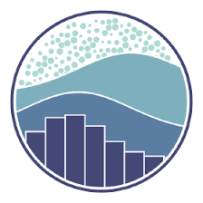
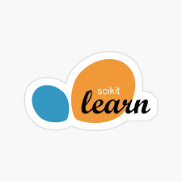

## Hi 👋 my name is Ryan

<!--
**rmodesitt/rmodesitt** is a ✨ _special_ ✨ repository because its `README.md` (this file) appears on your GitHub profile.

Here are some ideas to get you started:

- 🔭 I’m currently working on ...
- 🌱 I’m currently learning ...
- 👯 I’m looking to collaborate on ...
- 🤔 I’m looking for help with ...
- 💬 Ask me about ...
- 📫 How to reach me: ...
- 😄 Pronouns: ...
- ⚡ Fun fact: ...
-->

I am a data enthusiast and analysis fanatic who has recently entered the world of data science! I have been a Business Analyst and Product Owner the past 5 years, and am now using the skillsets from these roles to look at data in new ways using data visualization, machine learning algorithms, and predictive modeling. I have worked on many projects using Python and SQL. Currently, I am furthering my knowledge and experience in deep learning and neural networks.

## Tech stack and skills 💪

  
  
  
  
  
  
  
  
  

## Socials 🤳

  
  
  

